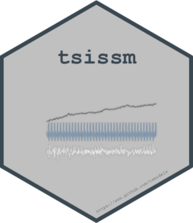

```{r, echo = FALSE}
version <- as.vector(read.dcf('DESCRIPTION')[, 'Version'])
version <- gsub('-', '.', version)
```

# tsissm 
[](https://github.com/tsmodels/tsissm/actions/workflows/rcmdcheck.yaml)
[)`-yellowgreen.svg)](/commits/master)
[](commits/master)
[](https://cran.r-project.org/package=tsissm)


```{r, echo = FALSE}
knitr::opts_chunk$set(
  collapse = TRUE,
  comment = "#>",
  fig.path = "README-"
)
```

# tsissm

Unobserved components model using the linear innovations state space representation (single source of error). 

Key features:

* Estimation using autodiff (TMB)
* Model selection and ensembling
* Regressors in the observation equation (non-time varying)
* Choice of distributions (Gaussian, Student and Johnson's SU)
* Choice of dynamics in variance (constant or GARCH)

Methods for specification (`modelspec`), estimation (`estimate`), 
summary with choice of vcov (`summary` and `vcov`), diagnostics (`tsdiagnose`), 
online filtering (`tsfilter`), prediction (`predict`), simulation (`simulate`), 
backtesting (`tsbacktest`) and profiling (`tsprofile`). Additionally, model selection (`auto_select`)
and ensembling (`tsensemble`) is also included.

## Known Issues

The default algorithm from the nloptr solver is SLSQP which will sometimes 
return NaN in the sampled parameters during a difficult optimization. This will 
immediately terminate the estimation with an error. The termination was introduced 
in version 1.0.2 of the package else it would crash the R process as a result of a crash in 
the underlying RTMB eigen evaluation function.

Currently, we try to catch these cases whenever there is no default control list
passed (i.e. it is NULL) and switch to another algorithm in those cases 
(see documentation of `estimate`). However, for safety, the users can wrap the 
estimate in a `try` expression, and when it does fail can switch to using the 
AUGLAG/MMA algorithm of the nloptr solver which does not return NaN parameters:

```{r,eval = FALSE}
# default algorithm is SLSQP
mod <- try(estimate(spec), silent = TRUE)
if (inherits(mod, 'try-error')) {
    mod <- estimate(spec, control = issm_control(algorithm = "AUGLAG/MMA"))
}
```
